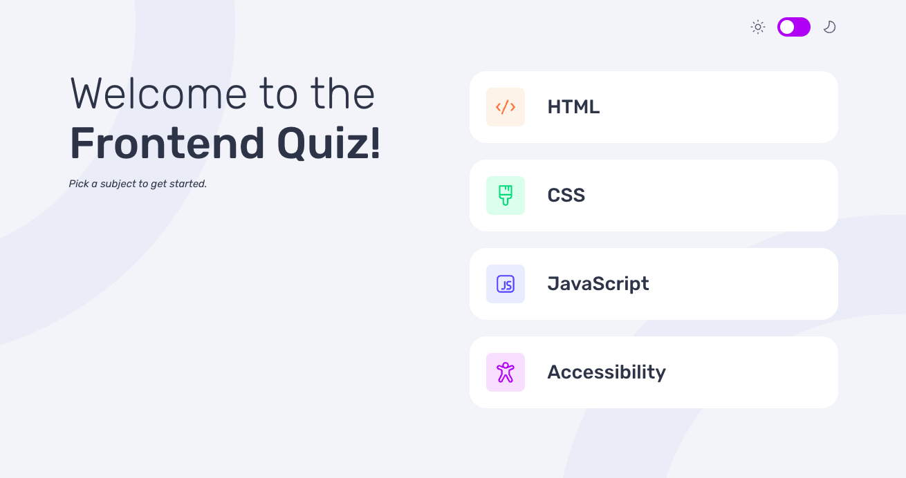

# Frontend Mentor - Frontend quiz app solution

This is a solution to the [Frontend quiz app challenge on Frontend Mentor](https://www.frontendmentor.io/challenges/frontend-quiz-app-BE7xkzXQnU). Frontend Mentor challenges help you improve your coding skills by building realistic projects.

## Table of contents

- [Frontend Mentor - Frontend quiz app solution](#frontend-mentor---frontend-quiz-app-solution)
  - [Table of contents](#table-of-contents)
  - [Overview](#overview)
    - [The challenge](#the-challenge)
    - [Screenshot](#screenshot)
    - [Links](#links)
  - [My process](#my-process)
    - [Tech Stack](#tech-stack)
  - [Author](#author)

## Overview

### The challenge

Users should be able to:

- Select a quiz subject
- Select a single answer from each question from a choice of four
- See an error message when trying to submit an answer without making a selection
- See if they have made a correct or incorrect choice when they submit an answer
- Move on to the next question after seeing the question result
- See a completed state with the score after the final question
- Play again to choose another subject
- View the optimal layout for the interface depending on their device's screen size
- See hover and focus states for all interactive elements on the page
- Navigate the entire app only using their keyboard
- **Bonus**: Change the app's theme between light and dark

### Screenshot

### Links

- Solution URL: [Frontend Mentor Solution](https://www.frontendmentor.io/challenges/frontend-quiz-app-BE7xkzXQnU)
- Live Site URL: [Deployed on Vercel](https://fm-frontend-quiz-app-rvqn.vercel.app/)

## My process

### Tech Stack

- [Next.js](https://nextjs.org/) - React framework
- [React](https://reactjs.org/) - UI library of JS
- [TypeScript](https://www.typescriptlang.org/) – Typed superset of JavaScript
- [tailwindcss](https://tailwindcss.com/) - utility-first CSS framework
- [node.js](https://nodejs.org/ja) - Runtime & Build Tools
- [Prisma](https://www.prisma.io/) – ORM & database toolkit
- [Neon](https://neon.com/) – Serverless PostgreSQL database platform
- [Vercel](https://vercel.com/home) – Deployment & hosting platform
- [shadcn/ui](https://ui.shadcn.com/) - A component collection built on Radix and Tailwind
- [class-variance-authority (cva)](https://cva.style/docs) - A library for conditionally managing Tailwind utility classes
- [next-themes](https://github.com/pacocoursey/next-themes) – Theme (dark/light) management library for React

## Author

- GitHub - [BlonoBuccellati](https://github.com/BlonoBuccellati)
- Frontend Mentor - [@BlonoBuccellati](https://www.frontendmentor.io/profile/BlonoBuccellati)
- zenn - [@bln](https://zenn.dev/bln)
